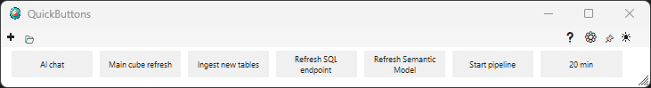
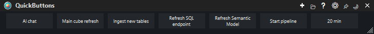
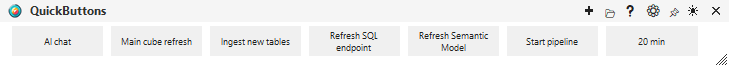
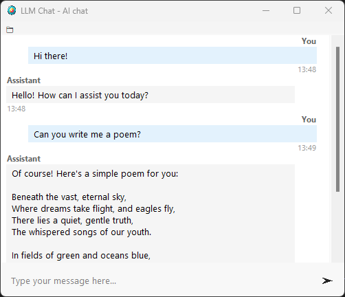

# QuickButtons


A simple button panel application that allows users to run programs, Python scripts, play music, and chat with LLMs. The application provides a floating, always-on-top interface for quick access to frequently used actions.

**Please note!** This project was created to test the limit of Cursor.com. (It took about 250 requests). I had a hard time getting it how I wanted it to be. It started to completely rewrite its code.

The AI's code has been thoroughly checked and corrected. The complexity of this project might have suited a different programming language a lot better. But it runs fine on multiple operating systems and start rather quickly.


## Overview

QuickButtons is a desktop utility that creates a customizable button grid. Each button can be configured to perform different actions such as opening applications, executing scripts, setting timers (including a pomodoro option), performing network tests, opening websites, playing audio files, or initiating LLM conversations. The application supports both light and dark themes and can operate in a minimal mode without window decorations.

## Screenshots






## Features

The application supports Python scripts, website opening, music playback, POST requests, shell commands, LLM chat using litellm (Azure OpenAI support), and countdown timers with sound notifications.

## Installation

### From Source
```bash
git clone https://github.com/rikheijmann/quickbuttons.git
cd quickbuttons
pip install -r requirements.txt
python src/main.py
```

### Building
```bash
# Activate virtual environment
python -m venv venv
venv\Scripts\activate

# Install build dependencies
pip install -r requirements-build.txt

# Build executable
pyinstaller QuickButtons.spec
```

The executable will be created in the `dist` folder.

You can can also use one of the two command line script (build-linux.sh or build-windows.bat), which do essentially do the same.

## Configuration

QuickButtons stores configuration in several files:

**`config/quickbuttons.json`**: Main application settings including window position, theme preferences, button configurations, and user preferences

**`assets/themes.json`**: Theme definitions for light and dark modes

**`assets/translations.json`**: Language translations (English and Dutch)

Configuration files are automatically created on first run. Users can modify these files directly or use the built-in settings dialog accessible through the application interface.

## Usage

Launch the application and configure buttons through the settings interface. Each button can be customized with icons, labels, and specific action parameters. The application remembers window position and user preferences between sessions.

## Requirements

- Python 3.8 or higher
- Tkinter (included with Python)
- Additional dependencies listed in `requirements.txt`

## License

MIT License - see LICENSE file for details.

## Support

For issues and questions, please use the [GitHub Issues](https://github.com/riktastic/quickbuttons/issues) page. 

Feel free to recommend new features (such as automatically hiding the button pane), grouping items and suggesting new buttons.